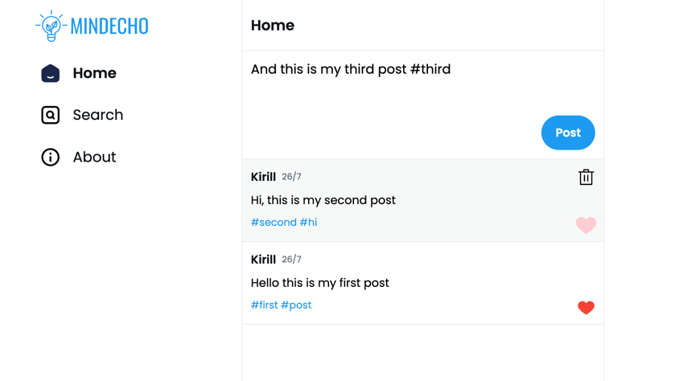

# MERN Stack Post App

This project is designed for practicing with the MERN (MongoDB, Express, React, Node.js) stack. The application provides a simple interface for publishing posts, with features like liking and deletion. The user interface resembles Twitter's style. 



## Getting Started

1. Clone this repository to your local machine.
2. Create a MongoDB cluster and obtain the connection string.
3. Rename the `.envsample` file to `.env` and replace the placeholder value with your MongoDB connection string.

## Technologies

- React
- TypeScript
- MongoDB
- Redux
- Redux Toolkit
- Express
- Node.js
- Tailwind CSS

## Usage

1. Install the dependencies by running: 
   ```shell
   cd client
   npm install
   
   cd server
   npm install
   ```
2. Start the development client and server:
   ```shell
   cd client
   npm start
   
   cd server
   npm start
   ```
3. Open your browser and navigate to http://localhost:3000 to access the app.

## Features

- Create and publish posts.
- Like and delete posts.
- User-friendly interface inspired by Twitter's design.
